# OJ项目报告
刘武韬 2024010729 liuwt24@mails.tsinghua.edu.cn
## 一、系统功能与设计

本OJ项目采用web后端框架FastAPI进行开发，配合SQLAlchemy实现数据的存取与管理，实现多语言在线评测功能。同时使用streamlit实现了简短的前端交互，直观地展示项目功能。

### 主要功能
**1. 用户管理：**    
实现基础的用户注册，登录，区分普通用户与管理员权限。   
提供多种系统维护接口，如语言注册、数据清空、权限控制等等

**2. 题目管理：**  
所有人均可发布题目，支持自由配置输入输出侧例
每道题目包含必需与可选信息
管理员可通过特定接口进行题目管理

**3. 提交与评测：**  
支持多种语言的评测，并且可动态注册新语言  
提供标准模式和特殊评判两种评测模式，管理员可自定义脚本进行评测  
记录运行时间，内存使用，评测详细状态等

**4. 日志与安全控制:**  
所有请求通过session模块校验权限  
管理员可查看评测日志与访问审计，并实现细粒度权限控制

### 系统架构设计
使用FastAPI实现后端的异步接口   
采取SQLite + SQLAlchemy，实现数据库管理   
利用Pydantic设计schema进行参数校验   
基于SessionMiddleware实现登录态管理，进行安全控制    
利用streamlit搭建前端，与后端实现分离，通过API进行数据流对接

### 模块划分

#### 主要部分   

**app/main.py:** 主程序入口  
**app/db.py:** 数据库初始化  
**app/models.py:**  定义User，Problem，Submission等数据库模型  
**app/schemas:**   存放参数结构  
**app/utils.py:**   存放工具函数：数据库依赖、权限判断、响应函数等   

**app/judge.py:**  评测部分函数

#### API接口
**app/users.py:** 存放用户管理接口  
**app/problems.py:**  存放题目管理接口  
**app/languages.py:**  存放语言管理接口  
**app/logs.py:** 存放日志管理接口  
**app/submissions.py:** 存放提交信息管理接口   
**app/reset.py:** 存放系统重置接口  
**app/import_data.py:** 存放导出数据接口  
**app/export_data.py:** 存放导入数据接口  
**app/special_judge.py** (拓展)存放特殊评测管理接口

### 前端框架

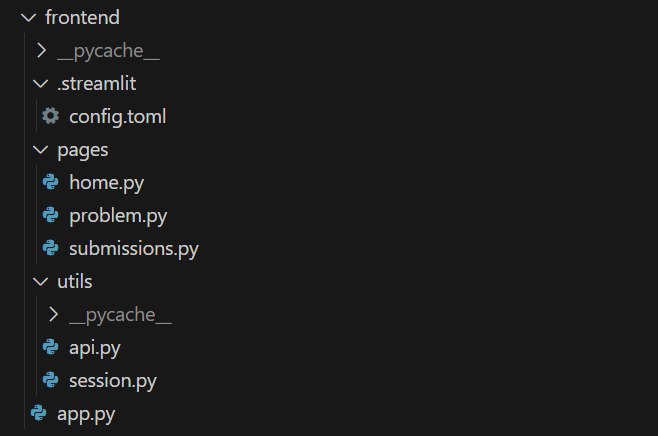
 
**/app.py:**  登录页    

**/pages:** 存放三个主要页面   
-**/home.py:** 主页（题目列表）  
-**/problem.py:** 题目详细信息与提交页      
-**/submissions.py:** 提交记录信息页   

**/utils:**    
-**/api.py** 存放与后端交互的接口
-**/session.py** 显示登录信息

**/.streamlit**  
-**/config.toml:** 页面主题 

## 二、关键实现

### 一般接口（以user.py中login函数为例）

```python
# app/users.py

#在router中定义函数，后挂载到main中app路由中
router = APIRouter(prefix="/api")

# ...

@router.post("/auth/login")
async def login(request: Request,    # 当前请求
                user_: New_User,     # 参数信息
                db: Session = Depends(get_db)  # 获取数据库 
                ):
    # 根据用户名从数据库寻找用户并核对密码
    user = db.query(User).filter_by(username=user_.username).first()
    if not user or not bcrypt.checkpw(    # 哈希加盐
        user_.password.encode("utf-8"), user.password.encode("utf-8")
    ):
        return make_response(401, "wrong username or password", None)
    if user.is_banned:      # 权限核验
        return make_response(403, "banned user", None)
    # 在session中记录登录信息
    request.session["user_id"] = user.id
    request.session["username"] = user.username
    request.session["role"] = user.role
    # 返回登陆成功响应
    return make_response(
        200,
        "login success",
        {"user_id": user.id, "username": user.username, "role": user.role},
    )
```

### 参数结构（以获取提交信息的参数为例）

```python
# app/schemas.py
class submission_list(BaseModel):
    # 所有参数均可选
    user_id: Optional[int] = None
    problem_id: Optional[str] = None
    status: Optional[str] = None
    page: Optional[int] = None
    page_size: Optional[int] = None
    # 但是需要根据要求校验正确性（另一部分校验在定义在接口中）
    def valid_params(self):
        # 搜索时userid和problemid不能都为空
        if self.user_id is None and self.problem_id is None:  
            return False   
        # 没有页码默认第一页
        if self.page is None:
            self.page = 1
        # 有页码但没有页面大小报错
        elif self.page is not None and self.page_size is None:
            return False
        # 查询状态只有三种
        if self.status not in ["success", "pending", "error", None]:
            return False
        return True
```

### 数据库结构（以Problem为例）

```python
# app/models.py
class Problem(Base):
    __tablename__ = "problems"
    # 必填信息
    id = Column(String, primary_key=True, index=True)
    title = Column(String, nullable=False)
    description = Column(Text, nullable=False)
    input_description = Column(Text, nullable=False)
    output_description = Column(Text, nullable=False)
    samples = Column(JSON, nullable=False)
    constraints = Column(Text, nullable=False)
    testcases = Column(JSON, nullable=False)
    public_cases = Column(Boolean, nullable=False, default=False)
    # 可选信息
    hint = Column(Text, nullable=True)
    source = Column(String, nullable=True)
    tags = Column(JSON, nullable=True)
    time_limit = Column(Float, nullable=True, default=3.0)
    memory_limit = Column(Integer, nullable=True, default=128)
    author = Column(String, nullable=True)
    difficulty = Column(String, nullable=True)
    # adv1中的评测模式，默认为standard
    judge_mode = Column(String, nullable=False, default="standard")
    # Submission由外键关联到某一Problem
    submissions = relationship(
        "Submission",
        back_populates="problem",
    )
    # 将部分信息转化为dict()
    def to_dict(self):
        return {
            "id": self.id,
            "title": self.title,
            "description": self.description,
            "input_description": self.input_description,
            "output_description": self.output_description,
            "samples": self.samples,
            "constraints": self.constraints,
            "testcases": self.testcases,
            "hint": self.hint if self.hint is not None else "",
            "source": self.source if self.source is not None else "",
            "tags": self.tags if self.tags is not None else [],
            "time_limit": self.time_limit,
            "memory_limit": self.memory_limit,
            "author": self.author if self.author is not None else "",
            "difficulty": self.difficulty if self.difficulty is not None else "",
            "judge_mode": self.judge_mode,
        }
```

### 评测部分

这一部分的难点主要在于异步的实现，并且因为初期设计时未考虑adv1中spj的实现导致接口设计较为混乱。最终经过多次修改，结合adv2中前端任务，完成了这一部分。

```python
# app/judge.py
async def run_judge(id: int, sub: submission, db: Session = Depends(get_db)):
    # ...获取信息...
    try:
        with tempfile.TemporaryDirectory() as tmpdir:
            src_path = os.path.join(tmpdir, "code" + language.file_ext)
            exe_path = os.path.join(tmpdir, "exec.out")
            with open(src_path, "w") as f:
                f.write(code)
            if language.compile_cmd:  # 如果需要编译
                compile_cmd = language.compile_cmd.format(src=src_path, exe=exe_path)
                compile_proc = subprocess.run(
                    shlex.split(compile_cmd), capture_output=True
                )
                # ...错误处理...
            else:
                exe_path = src_path
            run_cmd = language.run_cmd.format(src=src_path, exe=exe_path)
            # ...
            for i, case in enumerate(problem.testcases):
                if problem.judge_mode == "spj":   # spj
                    status = await judge_spj_case_async(
                        case, run_cmd, problem.time_limit, problem.memory_limit, problem.id,
                    )
                else:  # standard
                    status = await judge_case_async(
                        case, run_cmd, problem.time_limit, problem.memory_limit
                    )

                if status["status"] == "AC":
                    score += 10
                detail.append(status)
            #...
    # ...
```

### 前端部分

前端利用python的streamlit库进行搭建，这里仅展示部分
```python
# frontend/app.py

# ...

st.title("OJ 系统 - 登录")
# 通过st.session_state记录前端的登录信息，并与后端交互
if st.session_state.get("user_info"):   
    st.spinner(f"欢迎，{st.session_state.user_info.get("username")}！")
    time.sleep(0.5)
    st.switch_page("pages/home.py")

with st.form("login_form"):
    username = st.text_input("用户名")
    password = st.text_input("密码", type="password")
    confirm_password = None
    if (
        st.session_state.get("show_confirm_password")
        and st.session_state.show_confirm_password
    ):
        confirm_password = st.text_input("确认密码", type="password") 

# ...

```

## 三、成果展示

### 基础部分
能够顺利通过47个测试点

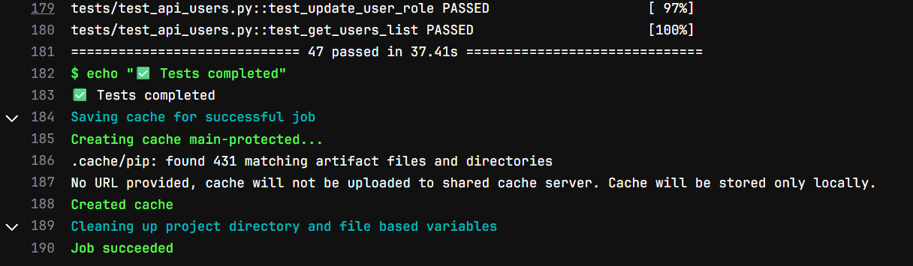


### adv1 特殊评测

自己编写了调用相关接口的代码，都能够顺利通过

```python
def test_create_union_problem_with_spj(client):
    setup_admin_session(client)
    # 添加问题
    problem_id = "union_" + uuid.uuid4().hex[:6]
    problem_data = {
        # ...
    }
    # 验证问题被正确添加

    # 上传spj脚本
    BASE_DIR = os.path.dirname(os.path.abspath(__file__))
    spj_path = os.path.join(BASE_DIR, "../app/spj_scripts/spj.py")
    assert os.path.exists(spj_path)

    with open(spj_path, "rb") as f:
        resp = client.post(
            f"/api/problems/{problem_id}/spj",
            files={"file": ("spj.py", f, "application/octet-stream")}
        )
    # 验证是否被正确添加
    assert resp.status_code == 200
    data = resp.json()
    assert data["code"] == 200
    assert data["msg"] == "judge mode updated"


def test_delete_union_problem_spj(client):
    # 添加题目
    setup_admin_session(client)
    problem_id = "union_" + uuid.uuid4().hex[:6]
    problem_data = {
        # ...
    }
    # ...验证题目添加...

    # 添加spj脚本
    BASE_DIR = os.path.dirname(os.path.abspath(__file__))
    spj_path = os.path.join(BASE_DIR, "../app/spj_scripts/spj.py")
    with open(spj_path, "rb") as f:
        resp = client.post(
            f"/api/problems/{problem_id}/spj",
            files={"file": ("spj.py", f, "application/octet-stream")}
        )
    assert resp.status_code == 200
    # ...

    # 删除spj
    resp = client.delete(f"/api/problems/{problem_id}/spj")
    assert resp.status_code == 200
    data = resp.json()
    assert data["code"] == 200
    assert data["msg"] == "spj script deleted"
    # 再次删除spj（会报错）
    resp = client.delete(f"/api/problems/{problem_id}/spj")
    assert resp.status_code == 400
    data = resp.json()
    assert data["code"] == 400
    assert data["msg"] == "no spj script to delete"
    # 验证judge_mode（应该为standard模式）
    resp = client.get(f"/api/problems/{problem_id}")
    assert resp.status_code == 200
    problem_info = resp.json()
    assert problem_info["data"]["judge_mode"] == "standard"
```

两个测试点都能够通过

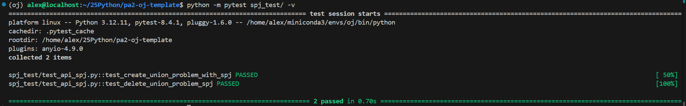


### 登陆页面

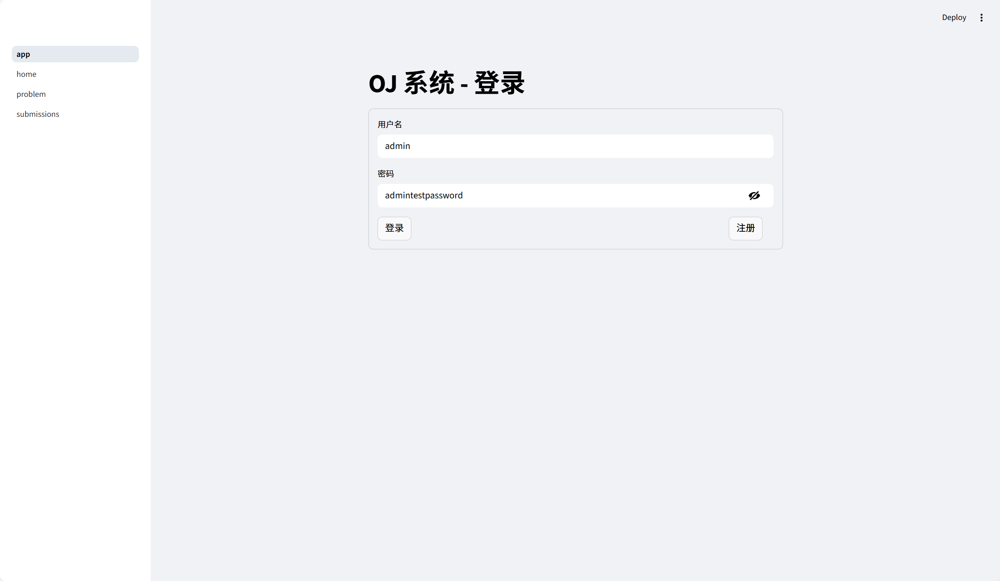

### 新用户注册
 
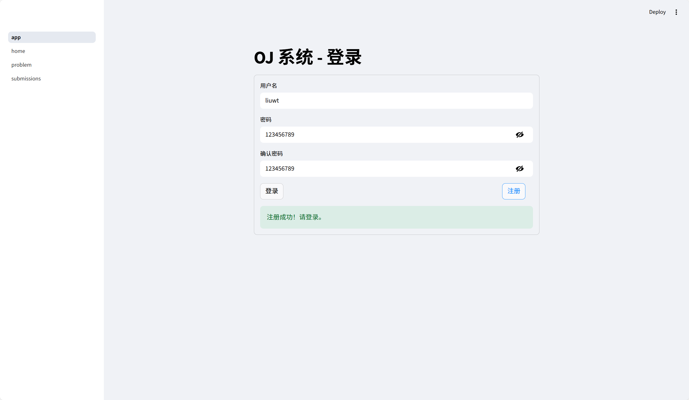

### 同一名称不能重复注册

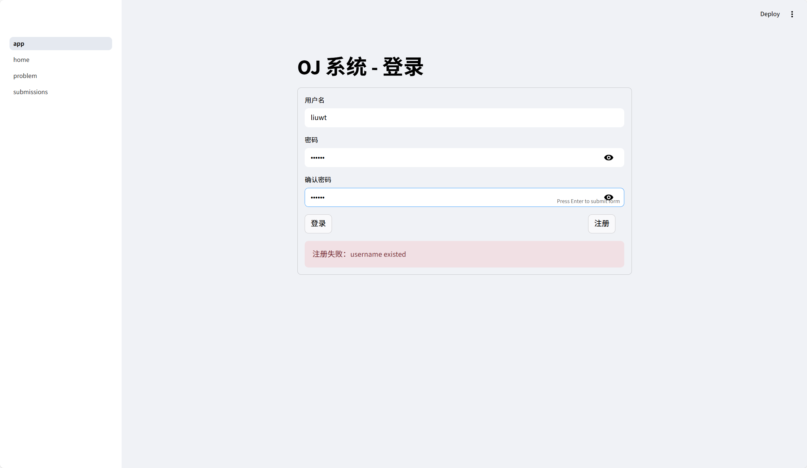

### 题目列表

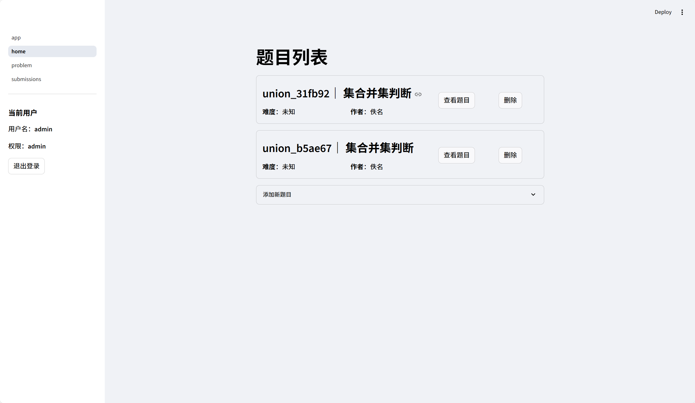

### 添加新题目

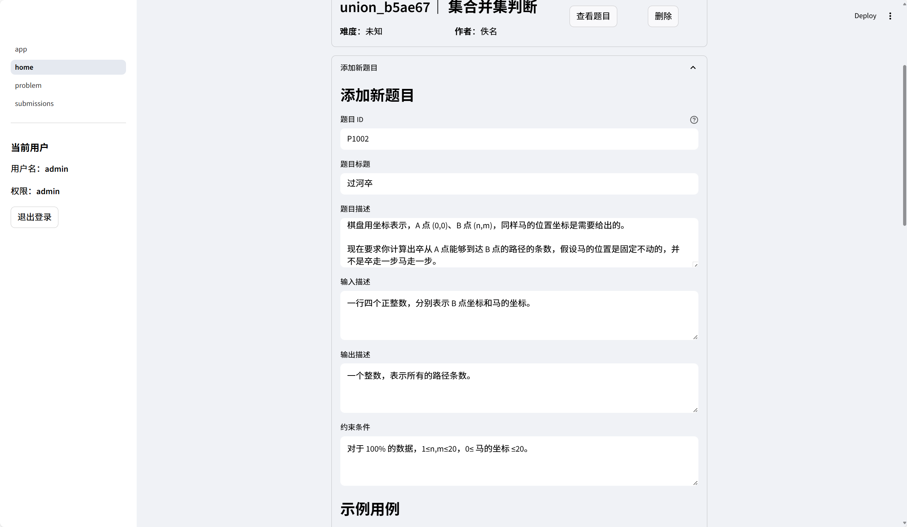


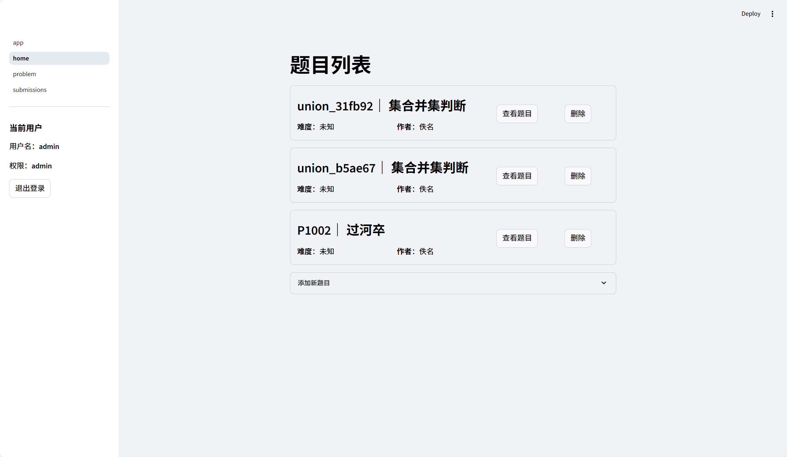

### 题目详细信息

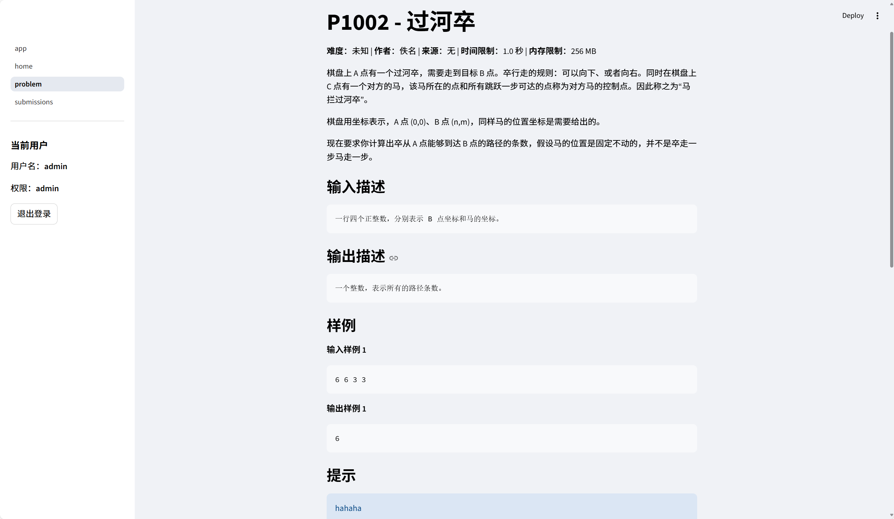

### 提交窗口（会显示测评模式，普通或者特殊）

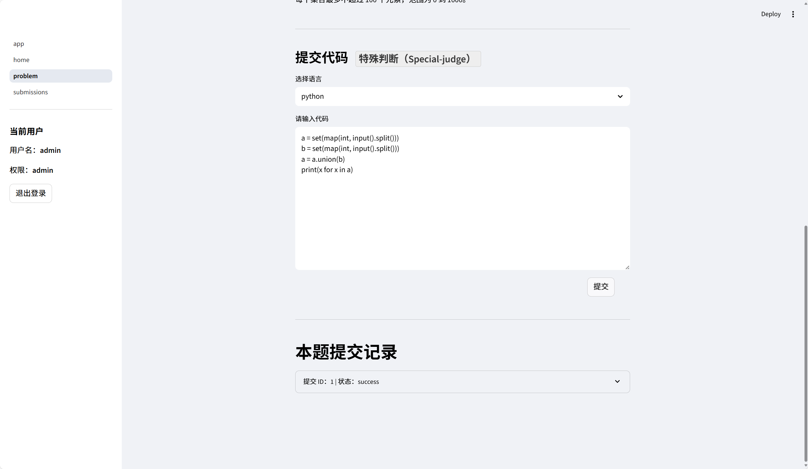

可以选择程序语言，默认支持python与cpp

### 提交记录

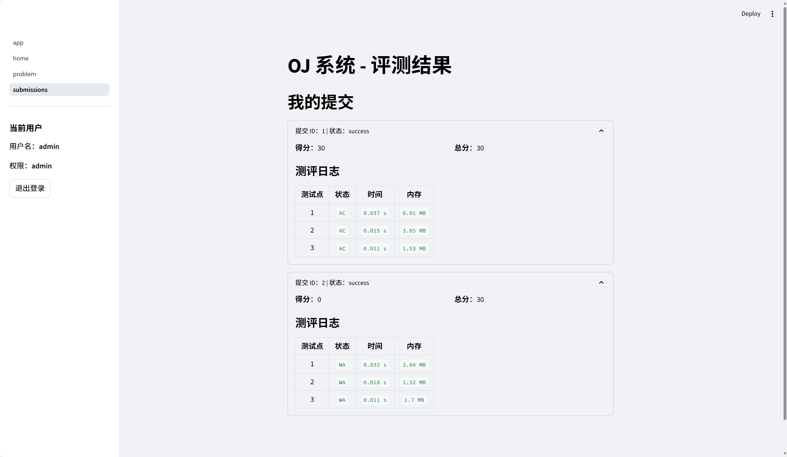

## 四、实验感想

完成本次大作业项目的流程比第一次大作业顺畅了许多，我对数据库的调用和后端接口开发更加熟练了一些。但是因为本次作业体量的原因，我并未对数据库设计接口，而是在API中直接对数据库进行操作，这会减少设计项目框架的工作量，但是写到后面就让接口的实现变得重复、繁琐，尽管所有功能都能实现，相对来说并没有通过接口与数据库交互那么简洁。   

我认为本项目最大的难点在于代码评测部分接口的异步化，并且我初步实现时并未考虑adv1中SPJ的部分，导致部分代码的冗余重复，并且结构混乱。尽管最终实现了功能，但我认为我对异步编程的了解还较为粗浅，需要日后深入学习理解。